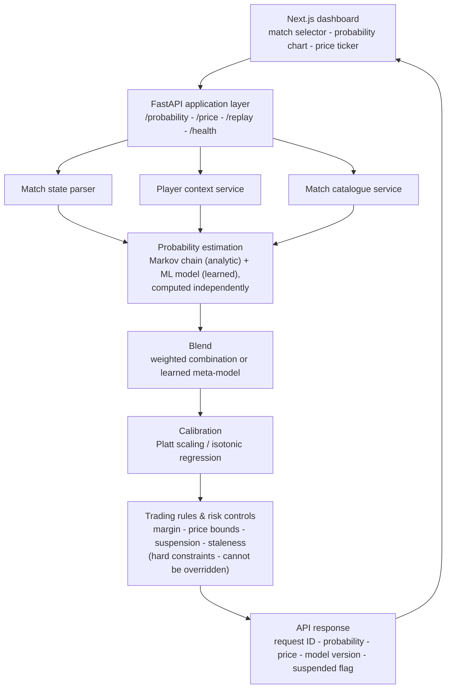

# CourtEdge

CourtEdge is an original in-play tennis probability and pricing research
prototype, inspired by the type of real-time pricing systems used by sports
betting companies. It is not a copy of any real bookmaker's product, brand
or proprietary pricing feed, and it is **not** a real-money trading system -
see [Prototype boundary](#prototype-boundary).

## Research question

> To what extent does a machine-learned in-play win-probability model,
> blended with a transparent point-based Markov chain baseline and refined
> by a learned calibration step, improve probabilistic accuracy and
> calibration compared with the Markov baseline alone and with observed
> historical market prices?

The project starts from a working but deliberately simple replay dashboard,
then builds a searchable match/point catalogue, an API, event
instrumentation and a labelled outcome set. Only once those foundations
exist does it introduce a Markov chain analytic baseline, a machine-learned
probability model, a blended combination, learned calibration, trading
rules, and a bounded, research-only market-comparison layer.

## Scope

**Being built:** a replay and pricing dashboard; a match/point/player
catalogue from permitted public data; a Next.js front end and FastAPI back
end; a PostgreSQL source of truth plus a DuckDB/Parquet feature-and-replay
store; a transparent Markov chain baseline; an ML win-probability model
(XGBoost/LightGBM); a validated blend and learned meta-model; a calibration
layer; a trading-rules layer (margin, price bounds, suspension, staleness);
a bounded, clearly labelled research-only market-comparison layer; and an
evaluation/monitoring layer.

**Not being built:** real-money wagering, payments or settlement; any copy
of a real bookmaker's branding or proprietary feed; a production identity/KYC
platform; unrestricted LLM control of prices or trading rules; an advanced
shot-level/biometric model without sufficient data; automatic retraining or
model promotion without review; ingestion of a paid or restricted-licence
feed; or any output presented as betting advice.

## Architecture

The request path recomputes a probability and indicative price after every
point, through independent analytic and learned estimates that are blended,
calibrated, and finally checked against hard trading rules before anything
is returned:



A failure in any advanced layer degrades to a simpler, honest method rather
than a fabricated price - e.g. if the ML model is unavailable, the system
serves the Markov-only probability and marks `ml_fallback: true`; if trading
rules themselves fail, pricing is suspended entirely. See
[docs/architecture/deployment.md](docs/architecture/deployment.md) for the
full fallback table.

Data flows through two stores with distinct jobs: **PostgreSQL** is the
transactional source of truth for matches, players, points and outcome
labels; a **DuckDB/Parquet feature-and-replay store**, rebuilt from
PostgreSQL, supports fast point-in-time feature computation. Model training
and calibration fitting run entirely offline, on match-level (never
point-level) splits, and serving loads only versioned artefacts from a model
registry - training never happens inside a live request.

For the full set of views (system context, data architecture, offline
training pipeline, deployment roles, security/governance) see
[docs/architecture/](docs/architecture/).

## Repository structure

```
courtedge/
├── frontend/            # Next.js replay and pricing dashboard
├── backend/             # FastAPI routes and orchestration
├── database/            # schemas, migrations and seeds
├── pricing/
│   ├── baselines/       # primitive 50/50 and score-leader heuristics
│   ├── markov/          # analytic point/game/set/match model
│   ├── ml/               # feature engineering and learned models
│   ├── blend/             # fusion and meta-model
│   └── calibration/       # Platt, isotonic and dynamic calibration
├── trading_rules/        # margin, suspension, staleness, value-flagging
├── experiments/           # reproducible investigations (see REGISTER.md)
├── discarded/              # clean rejected approaches + reasons
├── evaluation/              # outcome labels, metrics and reports
├── tests/
│   ├── unit/
│   ├── integration/
│   ├── scenario_regression/
│   └── data_quality/
├── infrastructure/          # containers and deployment config
└── docs/
    ├── architecture/        # system context, logical, data, offline, deployment, governance
    ├── decisions/            # architecture decision records (ADR 1, 2, 3 ...)
    ├── model_cards/
    ├── data_sheets/          # data provenance, permitted-data rules
    └── ethics/
```

## Documentation

| Document | Purpose |
|---|---|
| [docs/architecture/charter.md](docs/architecture/charter.md) | Full project charter: research question, in/out-of-scope, requirements, success measures. |
| [docs/architecture/](docs/architecture/) | System context, logical, data, offline-training, deployment and governance architectures. |
| [docs/decisions/](docs/decisions/) | Architecture decision records (ADR 1, 2, 3 ...; plain numbering, never zero-padded). |
| [docs/data_sheets/data_provenance.md](docs/data_sheets/data_provenance.md) | Approved data sources, licences and permitted-data rules. |
| [experiments/REGISTER.md](experiments/REGISTER.md) | The full planned experiment catalogue (EXP1, EXP2, ... EXP51; plain numbering) with status. |
| [docs/architecture/risk_register.md](docs/architecture/risk_register.md) | Known risks, assumptions and mitigations. |
| [docs/ROADMAP.md](docs/ROADMAP.md) | Journey roadmap, work packages, stage decision gates, testing matrix. |
| [docs/REFERENCES.md](docs/REFERENCES.md) | Academic and technical sources behind the modelling approach. |
| [docs/CourtEdge_Architecture_and_Task_Definition.docx](docs/CourtEdge_Architecture_and_Task_Definition.docx) | The original, full source specification this repository implements. |
| [docs/model_cards/blend_v1_calibrated.md](docs/model_cards/blend_v1_calibrated.md) | The served pipeline's model card: training data, feature schema, real evaluation numbers, caveats. |
| [docs/ethics/assessment.md](docs/ethics/assessment.md) | Privacy, fairness, responsible-gambling and licensing review - including the gaps it found, not only what passed. |
| [evaluation/FINAL_EVALUATION.md](evaluation/FINAL_EVALUATION.md) | The full evidence trail (EXP1 through EXP44) synthesised into one answer to the research question above. |

## Running it locally

The scenario library (`/`) works standalone on scripted mock data:

```bash
cd frontend
npm install
npm run dev
```

To also browse real matches (`/matches`), run the backend alongside it:

```bash
python -m uvicorn backend.main:app --reload
```

The backend serves a small synthetic demo match out of the box; point it
at real ingested data with `COURTEDGE_DATA_DIR` - see
[backend/README.md](backend/README.md) and
[database/README.md](database/README.md).

### Full demonstration (real data, the promoted pipeline, both dashboards)

```bash
# 1. Download the real archive (not committed - see database/README.md)
curl -O https://raw.githubusercontent.com/JeffSackmann/tennis_MatchChartingProject/master/charting-m-matches.csv
curl -O https://raw.githubusercontent.com/JeffSackmann/tennis_MatchChartingProject/master/charting-m-points-2010s.csv
curl -O https://raw.githubusercontent.com/JeffSackmann/tennis_MatchChartingProject/master/charting-m-points-2020s.csv

# 2. Promote the pricing pipeline (trains the ML model, fits the
#    calibrator, records a versioned entry in the model registry)
python -m pricing.run_promotion charting-m-matches.csv charting-m-points-2010s.csv charting-m-points-2020s.csv

# 3. Run the backend against the real archive
COURTEDGE_DATA_DIR=. python -m uvicorn backend.main:app --reload

# 4. Run the frontend (separate terminal)
cd frontend && npm install && npm run dev
```

Then open `/matches` to browse and replay real matches priced by the
full blended, calibrated pipeline (`model_version=blend_v1_calibrated`
in each response), and `/ops` for the monitoring dashboard - quote
latency, fallback/suspended rates, and the promoted model's own
calibration-time quality numbers. `python -m pricing.rollback_model
--list` shows every promoted version; see
[pricing/README.md](pricing/README.md) for rolling back to an earlier
one.

See [docs/ROADMAP.md](docs/ROADMAP.md) for the full 21-journey plan, the
stage decision gates each journey must pass before the next begins, and
current build status.

## Prototype boundary

This is a technical learning and portfolio project. It does not constitute
a compliant real-money betting system, and no part of it should be deployed
against real markets or real customers without full legal, regulatory and
responsible-gambling review.
