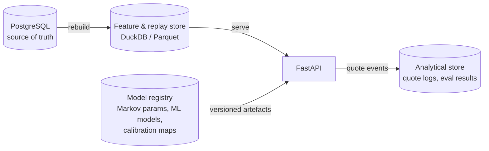

# Data architecture

## Operational entities

| Entity | Purpose | Key fields |
|---|---|---|
| Match | Shared tournament and fixture information. | `match_id`, `tournament`, `surface`, `round`, `best_of`, `date`, `player_a_id`, `player_b_id` |
| Player | Shared career and ranking information. | `player_id`, `name`, `current_rank`, `rank_points`, career serve/return rates |
| Point | One ball played, in sequence. | `match_id`, `point_no`, `set_no`, `game_no`, `server`, `point_winner`, raw score state |
| Probability request (quote) | One returned probability and price at one moment. | `probability_request_id`, `match_id`, `point_sequence`, `model_version`, `latency`, `fallback_used` |
| Quote event | A logged occurrence tied to a quote. | `event_id`, `type`, `probability_request_id`, `timestamp` |
| Outcome label | Ground-truth match result used for offline evaluation. | `match_id`, `actual_winner`, `final_score` |
| Experiment | Reproducible comparison of one configuration. | `experiment_id`, `hypothesis`, `configuration`, `metrics`, `decision` |
| Model record | Metadata for a trained or calibrated artefact. | `model_version`, `features`, `training_split`, `metrics`, `checksum`, `status` |

## Storage responsibilities

| Store | Responsibility | Not responsible for |
|---|---|---|
| PostgreSQL | Current matches, players, points and outcome labels. | Fast point-in-time feature replay. |
| Feature and replay store (DuckDB / Parquet) | Point-in-time feature computation and fast match replay. | Being the authoritative record. |
| Analytical store or files | Quote logs, experiment outputs and evaluation results. | Serving live probability requests directly. |
| Model registry / versioned artefacts | Markov parameter sets, ML models and calibration maps. | Replacing source-code version control. |
| Repository | Code, tests, schemas, configuration templates, ADRs and documentation. | Secrets or redistribution of licensed data. |

## Data quality gates

- Unique and non-null match and point identifiers.
- A monotonically increasing point sequence within each match.
- A valid server value on every point.
- Probability values within [0, 1] and prices ≥ 1.0, or null while suspended.
- No duplicate point records.
- Outcome labels consistent with the final recorded score.
- Model version tied to the source data snapshot it was trained on.
- Failure quarantines the affected match rather than corrupting the whole
  dataset.

These gates are implemented as tests in
[tests/data_quality](../../tests/data_quality).

## Source

Derived from `docs/CourtEdge_Architecture_and_Task_Definition.docx`, section 8.
