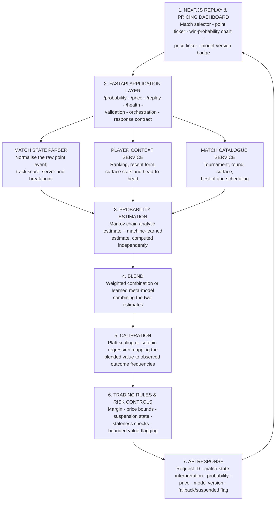

# Logical solution architecture

The logical view shows the main components and the direction of data flow.
It is technology-specific enough to guide implementation but remains
independent of a particular cloud deployment.



> **Ordering note.** During implementation, trading rules should be checked
> as early as supported and validated again before the response is
> returned. The diagram groups them near the end to make the policy
> visible, not to prescribe an inefficient double check.

## Online probability request sequence

| Step | Request behaviour |
|---|---|
| 1 | Player A wins a break point to level the second set at 4–4, on Player B's serve. |
| 2 | The replay engine sends the new point event to `POST /probability` with the match ID and point sequence number. |
| 3 | FastAPI validates the request and creates a `probability_request_id`. |
| 4 | The match state parser updates the score state: set 2, games 4–4, server = Player B, break point = false. |
| 5 | The Markov engine computes the analytic win probability from the current score using each player's estimated serve-win rate. |
| 6 | The ML model scores the same state plus player and match context features (ranking gap, recent form, surface). |
| 7 | The blend layer combines the two estimates using the validated weights for this match phase. |
| 8 | The calibration layer maps the blended value onto its empirically calibrated probability. |
| 9 | The trading rules layer applies the margin, checks price bounds, and confirms the match is not suspended. |
| 10 | A bounded value-flag compares the resulting price with the last known market price, for research analysis only, without altering the served probability. |
| 11 | The API returns the probability, price, interpretation, model version and `probability_request_id`. |
| 12 | The dashboard updates the live chart and ticker, and logs a quote event for later evaluation. |

## Example response contract

```json
{
  "probability_request_id": "req_7c31",
  "match_id": "demo_m001",
  "point_sequence": 184,
  "interpretation": {
    "set": 2, "games": "4-4", "server": "player_b", "break_point": false
  },
  "probability_player_a": 0.53,
  "price_player_a": 1.87,
  "price_player_b": 2.05,
  "model_version": "blend_v3_calibrated",
  "fallback_used": false,
  "suspended": false
}
```

## Source

Derived from `docs/CourtEdge_Architecture_and_Task_Definition.docx`, sections 6 and 7.
