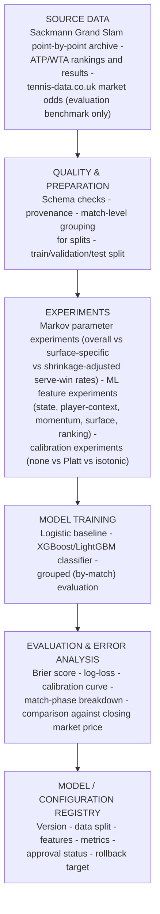

# Offline training and evaluation architecture

## Training controls

- Split by match, never by point: a model that has seen the middle of a
  match must never have seen its ending.
- Hold out an entire final set of tournaments as the test set until model
  selection is complete.
- Version feature-generation logic and use the same code in training and
  serving.
- Treat market odds as an evaluation benchmark, not as ground truth of the
  "true" probability.
- Clearly label any synthetic or simulated data.
- Retain simpler baselines and negative results.
- Explicitly audit for look-ahead bias: no feature may use information from
  after the point in question, such as a player's final match statistics
  leaking into an in-play feature.

## Source

Derived from `docs/CourtEdge_Architecture_and_Task_Definition.docx`, section 9.
