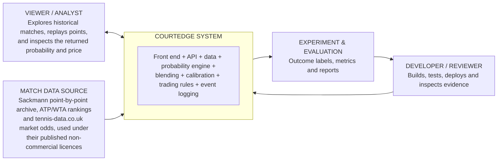

# System context architecture

The context view shows who or what interacts with CourtEdge, without
describing its internal code.

## Context boundaries

- CourtEdge does not process real bets, stakes or payments.
- CourtEdge does not connect to any live regulated market feed.
- Data inputs must have recorded provenance and confirmed usage rights (see
  [docs/data_sheets/data_provenance.md](../data_sheets/data_provenance.md)).
- Dashboard interaction logging exists only when it has a defined evaluation
  purpose.
- The system proposes a probability and an indicative price; humans and
  governance control any use beyond research.

## Source

Derived from `docs/CourtEdge_Architecture_and_Task_Definition.docx`, section 5.
